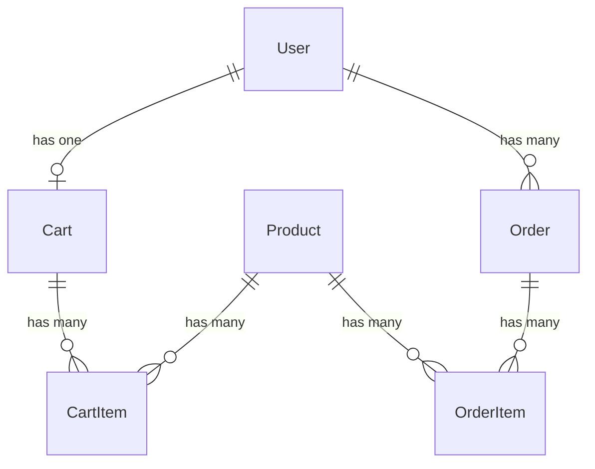

# Laravel Inertia E-commerce

A modern e-commerce application built with Laravel 12, React 19, Inertia.js, and Tailwind CSS.

## Overview

This is a full-stack e-commerce application featuring:

- Product browsing with search and pagination
- Shopping cart with stock validation
- Stripe Checkout integration
- Order management
- Background jobs (low stock notifications, daily sales reports)
- User authentication and settings

## Database Schema



## Tech Stack

- **Backend**: Laravel 12.x, PHP 8.2+
- **Frontend**: React 19, TypeScript, Tailwind CSS, shadcn/ui
- **State Management**: Inertia.js
- **Payment**: Laravel Cashier (Stripe)
- **Testing**: Pest PHP
- **Code Quality**: Laravel Pint, PHPStan (Larastan)

## Quick Setup

### Option 1: Native PHP

Run the setup script to install dependencies, configure environment, and seed the database:

```bash
composer setup
```

**Configure Stripe** (required for checkout):

1. Get your Stripe API keys from [Stripe Dashboard](https://dashboard.stripe.com/test/apikeys)
2. Add to `.env` file:

   ```env
   STRIPE_KEY=pk_test_your_publishable_key_here
   STRIPE_SECRET=sk_test_your_secret_key_here
   ```

Then start the development server:

```bash
composer dev
```

This starts the Laravel server, queue worker, and Vite dev server concurrently.

### Option 2: Docker (Laravel Sail)

If you prefer using Docker, use Laravel Sail:

```bash
# Start Sail containers
./vendor/bin/sail up -d

# Run setup inside container
./vendor/bin/sail composer setup
```

**Configure Stripe** (required for checkout):

1. Get your Stripe API keys from [Stripe Dashboard](https://dashboard.stripe.com/test/apikeys)
2. Add to `.env` file:

   ```env
   STRIPE_KEY=pk_test_your_publishable_key_here
   STRIPE_SECRET=sk_test_your_secret_key_here
   ```

Then start the development server:

```bash
./vendor/bin/sail composer dev
```

**Access**: <http://localhost:8000>

**Default login**: `admin@example.com` / `password`

## Documentation

- [Getting Started](docs/01-getting-started.md) - Complete setup guide
- [Payment Setup](docs/02-payment-setup.md) - Stripe configuration
- [Code Quality](docs/03-code-quality.md) - Pint, PHPStan usage
- [Testing](docs/04-testing.md) - Test coverage and guidelines
- [Troubleshooting](docs/05-troubleshooting.md) - Common issues and solutions

## Development

```bash
# Format code
composer format

# Static analysis
composer analyse

# Run tests
composer test

# All checks
composer review
```
